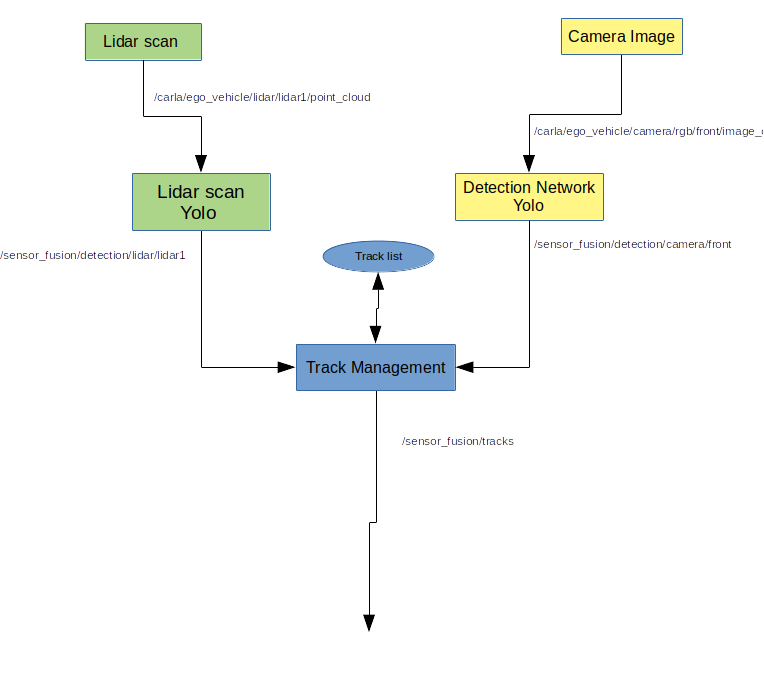
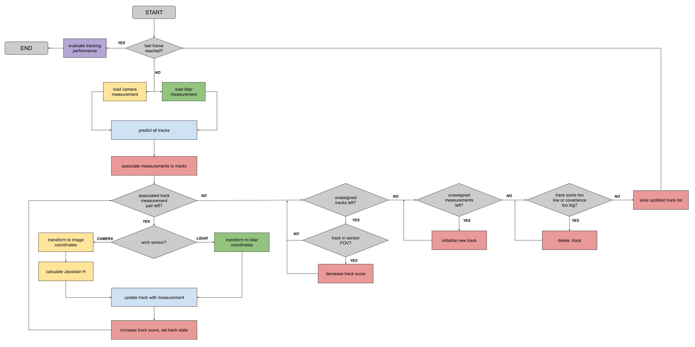

# Sensor Fusion

## Background

Sensor fusion gives the car the ability to use different sensors to detect and track objects around it such as cars, pedestrians and cyclists. A [Feature Pyramid Network or FPN](https://openaccess.thecvf.com/content_cvpr_2017/papers/Lin_Feature_Pyramid_Networks_CVPR_2017_paper.pdf) is used to detect objects from the lidar scan. An Extended Kalman Filter or EKF is used to predict, compare and track the objects from the lidar and camera results. Each new lidar scan or camera detection may introduce new objects or incorrect objects and has no context to past objects. This is why tracking is important; if an object appears in multiple consectuive lidar scans or images, then it can be concluded that the object is a real valid object.

## To Run

To disable sensor fusion, enter the following:
```bash
roslaunch mike_av_stack sensor_fusion.launch sensor_fusion:=false
```

## My Implementation

Detection is implemented for lidar only at the moment with FPN ResNet from the udacity course. Tracking is implemented for both lidar and camera. Detection subscribes to a point cloud topic. The raw lidar point cloud topic from the carla ros bridge is only a portion of the full 360% scan, so the sensor fusion node actually subscribes to the topic output by my point cloud stacker tool. This is then fed into the FPN resnet and detections are sent to another topic. The Sensor class has two child classes, Lidar and Camera which have callback functions to handle the sensor data then the detections. The tracking process is inside the detection callback function, filters and associates FPN ResNet output detections with known tracked objects, and updates the known tracked object list in the Trackmanagement class. The following crudely drawn diagram shows this at a high level.


At a slightly lower level, the following diagram from the udacity self driving car class has some more details.


This is a massive improvement upon the udacity code as this update process is now asynchronous. I also made sure to make the track list thread safe as many callbacks can call to change this or read from it at the same time.

In addition, I have implemented and added to the sensors.json that specifies sensors for carla ros bridge. My sensor fusion code is generic and will create a unique Lidar or Camera object for every camera, and each Sensor will subscribe to its base topic. Each sensor is also given the same trackmanagement object which also has a filter and association object for the other steps.


## TODO
- Add camera network
- Fix base topic subscription
- Change lidar and camera configs for better results
- Change to YOLO v3 or v4 instead of fpn resenet
- Add visualization for tracking

