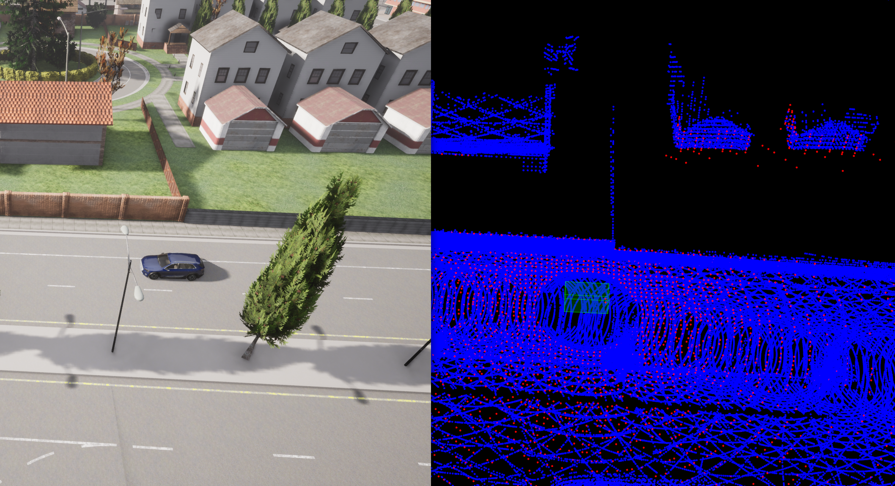

# Localization

## Background
Localization is the ability for the car to approximate its location given a perviously made map, and a lidar scan. There are many algorithms used to do this and a few examples are Iterative Closest Point or ICP and Normal Distributions Transform or NDT. These will be used in this project to localize.

## To run
Run the project as normal. 

To disable localization, enter the following:
```bash
roslaunch mike_av_stack localization.launch localization:=false
```

## My implementation
Currently ICP is fully implemented. A small map is provided initially. In addition, the lidar, gnss, and imu topics are subscribed to, providing a point cloud, position and rotation respectfully. Gnss and imu are only used for initial position right now, but I plan on using EKF to update its position estimation. 

Localization subscribes to a point cloud topic. The raw lidar point cloud topic from the carla ros bridge is only a portion of the full 360% scan, so the localization node actually subscribes to the topic output by my point cloud stacker tool.

The result can be seen here.



You may notice this looks similar to the example from the udacity self driving course. And you'd be right! I have quite a few changes though, most notably, the scans come from ros, and the initial position is collected from gnss and imu topics. The goal is to use an EKF to fuse ICP, NDT and gnss.

## Todo
- Use EKF to fuse ICP, NDT, GNSS
- Use yolo object detection to create 
- SLAM! 